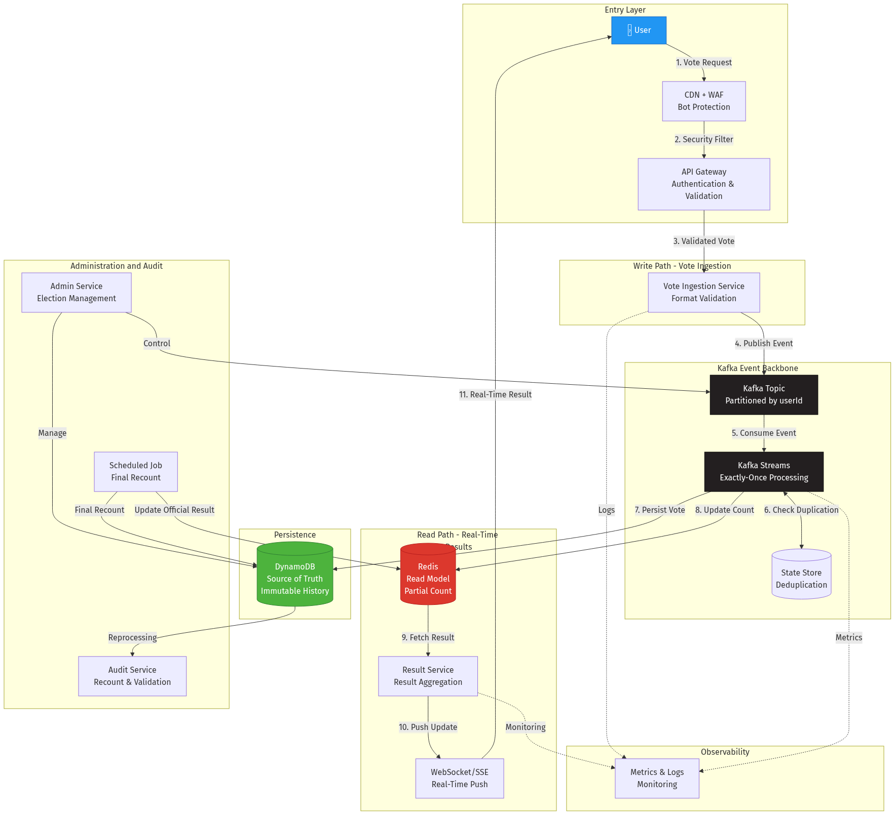
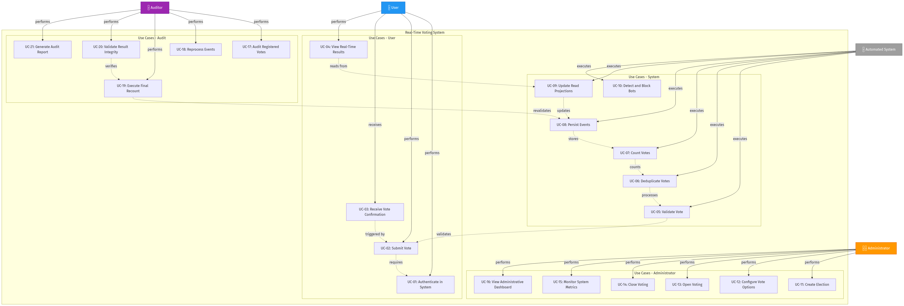

# 📦 Deliverables - Real-Time Voting System

This document consolidates all deliverables generated for **Section 4.1 (Overall Architecture)** and **Section 4.3 (Use Cases)** of the project.

---

## 📋 Deliverables Index

### 1️⃣ Overall Architecture Diagram

#### 📄 Complete Documentation
- **File**: [`overall-architecture-diagram-EN.md`](./overall-architecture-diagram/overall-architecture-diagram-EN.md)
- **Content**:
  - Interactive Mermaid diagram
  - Key architectural decisions
  - Component details
  - Data flow (Write Path, Read Path, Audit)
  - System guarantees
  - Scalability strategies

#### 🖼️ Diagram Images
- **PNG (High resolution)**: [`overall-architecture-diagram-EN.png`](./overall-architecture-diagram/image/overall-architecture-diagram-EN.png) - 216 KB
  - Raster format, ideal for presentations and documents
- **SVG (Vector)**: [`overall-architecture-diagram-EN.svg`](./overall-architecture-diagram/image/overall-architecture-diagram-EN.svg) - 44 KB
  - Vector format, scalable without quality loss

**Diagram Preview:**


---

### 2️⃣ Use Case Diagram

#### 📄 Complete Documentation
- **File**: [`use-case-diagram-EN.md`](./use-case-diagram/use-case-diagram-EN.md)
- **Content**:
  - Mermaid diagram with 21 use cases
  - Complete details of each use case
  - 4 identified actors (User, System, Administrator, Auditor)
  - Main and alternative flows
  - Preconditions and postconditions
  - Relations and dependencies
  - Non-functional requirements
  - Prioritization (MVP, Phase 2, Phase 3)

#### 🖼️ Diagram Images
- **PNG (High resolution)**: [`use-case-diagram-EN.png`](./use-case-diagram/image/use-case-diagram-EN.png) - 293 KB
  - Raster format, ideal for presentations and documents
- **SVG (Vector)**: [`use-case-diagram-EN.svg`](./use-case-diagram/image/use-case-diagram-EN.svg) - 60 KB
  - Vector format, scalable without quality loss

**Diagram Preview:**


---

## 🎯 Use Cases Summary

### 👤 User (4 use cases)
1. **UC-01**: Authenticate in System
2. **UC-02**: Submit Vote
3. **UC-03**: Receive Vote Confirmation
4. **UC-04**: View Real-Time Results

### 🤖 Automated System (6 use cases)
5. **UC-05**: Validate Vote
6. **UC-06**: Deduplicate Votes
7. **UC-07**: Count Votes
8. **UC-08**: Persist Events
9. **UC-09**: Update Read Projections
10. **UC-10**: Detect and Block Bots

### 👨‍💼 Administrator (6 use cases)
11. **UC-11**: Create Election
12. **UC-12**: Configure Vote Options
13. **UC-13**: Open Voting
14. **UC-14**: Close Voting
15. **UC-15**: Monitor System Metrics
16. **UC-16**: View Administrative Dashboard

### 🔍 Auditor (5 use cases)
17. **UC-17**: Audit Registered Votes
18. **UC-18**: Reprocess Events
19. **UC-19**: Execute Final Recount
20. **UC-20**: Validate Result Integrity
21. **UC-21**: Generate Audit Report

---

## 🏗️ Main Architecture Components

| Component | Responsibility | Technology |
|-----------|----------------|------------|
| **CDN + WAF** | Bot and DDoS protection | CloudFlare / AWS CloudFront |
| **API Gateway** | Authentication, rate limiting | Kong / AWS API Gateway |
| **Vote Ingestion Service** | Event validation and publishing | Java / Spring Boot |
| **Kafka** | Event streaming and event persistence | Apache Kafka |
| **Kafka Streams** | Processing and deduplication | Kafka Streams API |
| **DynamoDB** | Source of truth, immutable history | AWS DynamoDB |
| **Redis** | Read model, real-time counting | Redis Cluster |
| **Result Service** | Result aggregation and delivery | Java / Spring Boot |
| **WebSocket/SSE** | Real-time update push | Spring WebFlux |
| **Admin Service** | Election and configuration management | Java / Spring Boot |
| **Audit Service** | Audit and recount | Java / Spring Batch |

---

## ✅ System Guarantees

- ✅ **No votes lost** - DynamoDB + Kafka with persistence
- ✅ **One vote per user** - State Store + partitioning by userId
- ✅ **Exactly-once processing** - Kafka Streams with transactions
- ✅ **Real-time** - Redis + WebSocket
- ✅ **Auditable** - Immutable events in DynamoDB
- ✅ **Resilient** - Distributed architecture with failover
- ✅ **Scalable** - Supports 250k votes/second at peak

---

## 📊 Architectural Decisions

### 1. Event-Driven Architecture
- Kafka as central backbone
- Immutable and auditable events
- Decoupling between producers and consumers

### 2. CQRS (Command Query Responsibility Segregation)
- **Write Path**: DynamoDB as source of truth
- **Read Path**: Redis as optimized read model
- Independent scalability

### 3. Exactly-Once Processing
- Kafka Streams with exactly-once semantics
- State Stores for real-time deduplication
- Partitioning by userId ensures ordering

### 4. Eventual Consistency + Reconciliation
- Redis provides real-time results
- DynamoDB maintains complete history
- Scheduled job executes final recount

---

## 📁 File Structure

```
.
├── DELIVERABLES-EN.md                      # This file (deliverables index)
├── overall-architecture-diagram-EN.md       # Complete architecture documentation
├── overall-architecture-diagram-EN.png      # Architecture diagram (PNG)
├── overall-architecture-diagram-EN.svg      # Architecture diagram (SVG)
├── use-case-diagram-EN.md                   # Complete use cases documentation
├── use-case-diagram-EN.png                  # Use case diagram (PNG)
├── use-case-diagram-EN.svg                  # Use case diagram (SVG)
├── overall-diagrams-EN.md                   # Source document with architectural analysis
└── plan.md                                  # Research plan and deliverables
```

---

## 🚀 How to Use the Deliverables

### For Presentations
- Use **PNG** files to include in slides (PowerPoint, Google Slides, Keynote)
- Diagrams have high resolution and transparent background

### For Technical Documentation
- Use **SVG** files for inclusion in web documents or wikis
- Vector format allows zooming without quality loss

### For Review and Editing
- The **.md** files contain the original Mermaid code
- Can be edited and re-rendered as needed

### For Version Control
- All markdown files can be versioned in Git
- Mermaid diagrams are treated as source code

---

## 🔗 References

- **Base Document**: [`overall-diagrams-EN.md`](./overall-diagrams-EN.md)
- **Research Plan**: [`plan.md`](./plan.md)
- **Concepts (PT)**: [`concepts-PT.md`](./concepts-PT.md)
- **Concepts (EN)**: [`concepts-EN.md`](./concepts-EN.md)

---

## 📝 Notes

- All diagrams were generated using **Mermaid** via **Kroki API**
- Diagrams can be easily updated by editing the Mermaid blocks in .md files
- To re-generate images, use Kroki API or local tools like mermaid-cli

---

**Generated on**: January 16, 2026
**Responsible**: Person 2 - High-Level Architecture & Use Cases
**Status**: ✅ Complete
