# Overall Architecture Diagram
## Real-Time Voting System

```mermaid
graph TB
    subgraph "Entry Layer"
        User[👤 User]
        CDN[CDN + WAF<br/>Bot Protection]
        Gateway[API Gateway<br/>Authentication & Validation]
    end

    subgraph "Write Path - Vote Ingestion"
        VoteIngestion[Vote Ingestion Service<br/>Format Validation]
    end

    subgraph "Kafka Event Backbone"
        KafkaTopic[Kafka Topic<br/>Partitioned by userId]
        KafkaStreams[Kafka Streams<br/>Exactly-Once Processing]
        StateStore[(State Store<br/>Deduplication)]
    end

    subgraph "Persistence"
        DynamoDB[(DynamoDB<br/>Source of Truth<br/>Immutable History)]
    end

    subgraph "Read Path - Real-Time Results"
        Redis[(Redis<br/>Read Model<br/>Partial Count)]
        ResultService[Result Service<br/>Result Aggregation]
        WebSocket[WebSocket/SSE<br/>Real-Time Push]
    end

    subgraph "Administration and Audit"
        Admin[Admin Service<br/>Election Management]
        Audit[Audit Service<br/>Recount & Validation]
        ScheduledJob[Scheduled Job<br/>Final Recount]
    end

    subgraph "Observability"
        Metrics[Metrics & Logs<br/>Monitoring]
    end

    %% Voting Flow
    User -->|1. Vote Request| CDN
    CDN -->|2. Security Filter| Gateway
    Gateway -->|3. Validated Vote| VoteIngestion
    VoteIngestion -->|4. Publish Event| KafkaTopic

    %% Stream Processing
    KafkaTopic -->|5. Consume Event| KafkaStreams
    KafkaStreams <-->|6. Check Duplication| StateStore
    KafkaStreams -->|7. Persist Vote| DynamoDB
    KafkaStreams -->|8. Update Count| Redis

    %% Real-Time Return
    Redis -->|9. Fetch Result| ResultService
    ResultService -->|10. Push Update| WebSocket
    WebSocket -->|11. Real-Time Result| User

    %% Administration
    Admin -->|Manage| DynamoDB
    Admin -->|Control| KafkaTopic

    %% Audit
    DynamoDB -->|Reprocessing| Audit
    ScheduledJob -->|Final Recount| DynamoDB
    ScheduledJob -->|Update Official Result| Redis

    %% Observability
    VoteIngestion -.->|Logs| Metrics
    KafkaStreams -.->|Metrics| Metrics
    ResultService -.->|Monitoring| Metrics

    style DynamoDB fill:#4DB33D,stroke:#2E7D32,color:#fff
    style Redis fill:#DC382D,stroke:#B71C1C,color:#fff
    style KafkaTopic fill:#231F20,stroke:#000,color:#fff
    style KafkaStreams fill:#231F20,stroke:#000,color:#fff
    style User fill:#2196F3,stroke:#1565C0,color:#fff
```

## Key Architectural Decisions

### 1️⃣ Event-Driven Architecture
- **Kafka** as central backbone
- Immutable and auditable events
- Decoupling between producers and consumers

### 2️⃣ CQRS (Command Query Responsibility Segregation)
- **Write Path**: DynamoDB as source of truth
- **Read Path**: Redis as optimized read model
- Independent scalability for reads and writes

### 3️⃣ Exactly-Once Processing
- **Kafka Streams** with exactly-once semantics
- **State Stores** for real-time deduplication
- Partitioning by userId ensures ordering

### 4️⃣ Eventual Consistency + Reconciliation
- Redis provides real-time results (low latency)
- DynamoDB maintains complete and immutable history
- Scheduled job executes final recount for official result

## Main Components

| Component | Responsibility | Technology |
|-----------|----------------|------------|
| **CDN + WAF** | Bot and DDoS protection | CloudFlare / AWS CloudFront |
| **API Gateway** | Authentication, rate limiting | Kong / AWS API Gateway |
| **Vote Ingestion Service** | Event validation and publishing | Java / Spring Boot |
| **Kafka** | Event streaming and event persistence | Apache Kafka |
| **Kafka Streams** | Processing and deduplication | Kafka Streams API |
| **DynamoDB** | Source of truth, immutable history | AWS DynamoDB |
| **Redis** | Read model, real-time counting | Redis Cluster |
| **Result Service** | Result aggregation and delivery | Java / Spring Boot |
| **WebSocket/SSE** | Real-time update push | Spring WebFlux |
| **Admin Service** | Election and configuration management | Java / Spring Boot |
| **Audit Service** | Audit and recount | Java / Spring Batch |

## Detailed Data Flow

### Write Path
1. **User** submits vote through frontend
2. **CDN + WAF** filters malicious requests
3. **API Gateway** validates authentication and rate limits
4. **Vote Ingestion Service** validates vote format
5. **Kafka** receives vote event (partitioned by userId)
6. **Kafka Streams** processes event:
   - Checks State Store if user already voted
   - Applies deduplication logic
   - Guarantees exactly-once semantics
7. **DynamoDB** persists vote immutably
8. **Redis** is updated with partial count

### Read Path
1. **User** requests results
2. **Result Service** fetches aggregated data from Redis
3. **WebSocket/SSE** sends real-time updates
4. **Frontend** displays results with low latency

### Audit Path
1. **Scheduled Job** executes complete recount on DynamoDB
2. **Audit Service** validates data integrity
3. **Redis** is updated with official result
4. **Logs and metrics** are stored for compliance

## System Guarantees

✅ **No votes lost** - DynamoDB + Kafka with persistence
✅ **One vote per user** - State Store + partitioning by userId
✅ **Exactly-once processing** - Kafka Streams with transactions
✅ **Real-time** - Redis + WebSocket
✅ **Auditable** - Immutable events in DynamoDB
✅ **Resilient** - Distributed architecture with failover
✅ **Scalable** - Supports 250k votes/second at peak

## Scalability

- **Kafka**: Horizontal partitioning (100+ partitions)
- **DynamoDB**: Auto-scaling with provisioned capacity
- **Redis**: Cluster mode with sharding
- **Microservices**: Replicated instances with load balancer
- **Kafka Streams**: Automatic parallelization per partition
