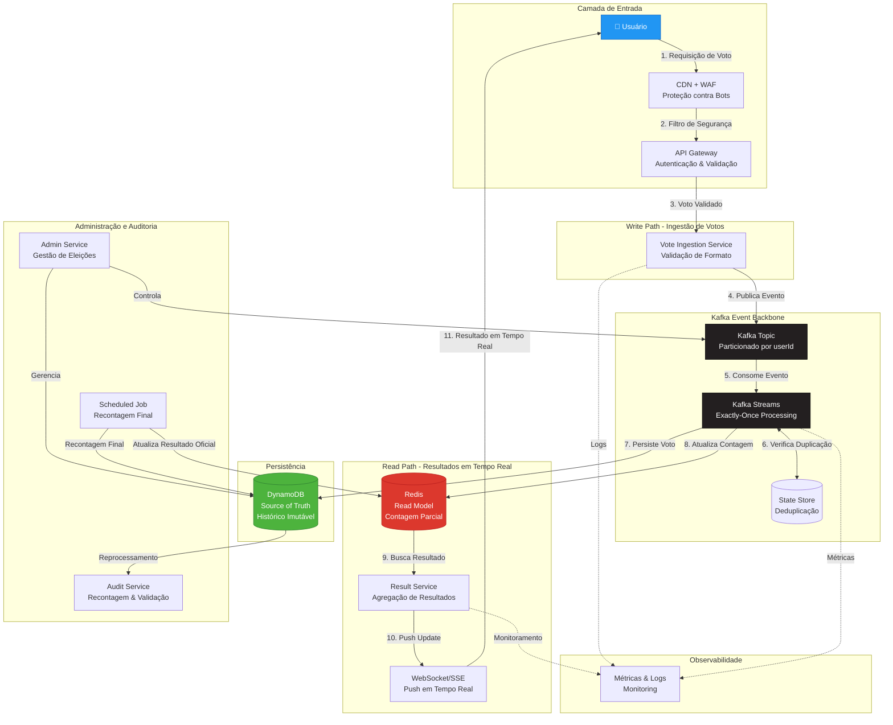

# Diagrama de Arquitetura Geral
## Sistema de Votação em Tempo Real

## Decisões Arquiteturais Chave

### 1️⃣ Arquitetura Orientada a Eventos
- **Kafka** como backbone central
- Eventos imutáveis e auditáveis
- Desacoplamento entre produtores e consumidores

### 2️⃣ CQRS (Command Query Responsibility Segregation)
- **Write Path**: DynamoDB como source of truth
- **Read Path**: Redis como read model otimizado
- Escalabilidade independente de leitura e escrita

### 3️⃣ Exactly-Once Processing
- **Kafka Streams** com semântica exactly-once
- **State Stores** para deduplicação em tempo real
- Particionamento por userId garante ordenação

### 4️⃣ Consistência Eventual + Reconciliação
- Redis fornece resultados em tempo real (baixa latência)
- DynamoDB mantém histórico completo e imutável
- Job agendado executa recontagem final para resultado oficial

## Componentes Principais

| Componente | Responsabilidade | Tecnologia |
|------------|------------------|------------|
| **CDN + WAF** | Proteção contra bots e DDoS | CloudFlare / AWS CloudFront |
| **API Gateway** | Autenticação, rate limiting | Kong / AWS API Gateway |
| **Vote Ingestion Service** | Validação e publicação de eventos | Java / Spring Boot |
| **Kafka** | Event streaming e persistência de eventos | Apache Kafka |
| **Kafka Streams** | Processamento e deduplicação | Kafka Streams API |
| **DynamoDB** | Source of truth, histórico imutável | AWS DynamoDB |
| **Redis** | Read model, contagem em tempo real | Redis Cluster |
| **Result Service** | Agregação e entrega de resultados | Java / Spring Boot |
| **WebSocket/SSE** | Push de atualizações em tempo real | Spring WebFlux |
| **Admin Service** | Gestão de eleições e configurações | Java / Spring Boot |
| **Audit Service** | Auditoria e recontagem | Java / Spring Batch |

## Fluxo de Dados Detalhado

### Caminho de Escrita (Write Path)
1. **Usuário** submete voto através do frontend
2. **CDN + WAF** filtra requisições maliciosas
3. **API Gateway** valida autenticação e rate limits
4. **Vote Ingestion Service** valida formato do voto
5. **Kafka** recebe evento de voto (particionado por userId)
6. **Kafka Streams** processa evento:
   - Verifica no State Store se usuário já votou
   - Aplica lógica de deduplicação
   - Garante exactly-once semantics
7. **DynamoDB** persiste voto de forma imutável
8. **Redis** é atualizado com contagem parcial

### Caminho de Leitura (Read Path)
1. **Usuário** solicita resultados
2. **Result Service** busca dados agregados no Redis
3. **WebSocket/SSE** envia atualizações em tempo real
4. **Frontend** exibe resultados com baixa latência

### Caminho de Auditoria
1. **Scheduled Job** executa recontagem completa no DynamoDB
2. **Audit Service** valida integridade dos dados
3. **Redis** é atualizado com resultado oficial
4. **Logs e métricas** são armazenados para compliance

## Garantias do Sistema

✅ **Nenhum voto é perdido** - DynamoDB + Kafka com persistência

✅ **Um voto por usuário** - State Store + particionamento por userId

✅ **Exactly-once processing** - Kafka Streams com transações

✅ **Tempo real** - Redis + WebSocket

✅ **Auditável** - Eventos imutáveis no DynamoDB

✅ **Resiliente** - Arquitetura distribuída com failover

✅ **Escalável** - Suporta 250k votos/segundo em picos

## Escalabilidade

- **Kafka**: Particionamento horizontal (100+ partições)
- **DynamoDB**: Auto-scaling com provisioned capacity
- **Redis**: Cluster mode com sharding
- **Microservices**: Instâncias replicadas com load balancer
- **Kafka Streams**: Paralelização automática por partição
