# Use Case Diagram
## Real-Time Voting System

```mermaid
graph TB
    subgraph System["Real-Time Voting System"]
        subgraph UC_User["Use Cases - User"]
            UC1[UC-01: Authenticate in System]
            UC2[UC-02: Submit Vote]
            UC3[UC-03: Receive Vote Confirmation]
            UC4[UC-04: View Real-Time Results]
        end

        subgraph UC_System["Use Cases - System"]
            UC5[UC-05: Validate Vote]
            UC6[UC-06: Deduplicate Votes]
            UC7[UC-07: Count Votes]
            UC8[UC-08: Persist Events]
            UC9[UC-09: Update Read Projections]
            UC10[UC-10: Detect and Block Bots]
        end

        subgraph UC_Admin["Use Cases - Administrator"]
            UC11[UC-11: Create Election]
            UC12[UC-12: Configure Vote Options]
            UC13[UC-13: Open Voting]
            UC14[UC-14: Close Voting]
            UC15[UC-15: Monitor System Metrics]
            UC16[UC-16: View Administrative Dashboard]
        end

        subgraph UC_Audit["Use Cases - Audit"]
            UC17[UC-17: Audit Registered Votes]
            UC18[UC-18: Reprocess Events]
            UC19[UC-19: Execute Final Recount]
            UC20[UC-20: Validate Result Integrity]
            UC21[UC-21: Generate Audit Report]
        end
    end

    %% Actors
    User[👤 User]
    SystemActor[🤖 Automated System]
    Admin[👨‍💼 Administrator]
    Auditor[🔍 Auditor]

    %% Relationships - User
    User -->|performs| UC1
    User -->|performs| UC2
    User -->|receives| UC3
    User -->|performs| UC4

    %% Relationships - System
    SystemActor -->|executes| UC5
    SystemActor -->|executes| UC6
    SystemActor -->|executes| UC7
    SystemActor -->|executes| UC8
    SystemActor -->|executes| UC9
    SystemActor -->|executes| UC10

    %% Relationships - Administrator
    Admin -->|performs| UC11
    Admin -->|performs| UC12
    Admin -->|performs| UC13
    Admin -->|performs| UC14
    Admin -->|performs| UC15
    Admin -->|performs| UC16

    %% Relationships - Audit
    Auditor -->|performs| UC17
    Auditor -->|performs| UC18
    Auditor -->|performs| UC19
    Auditor -->|performs| UC20
    Auditor -->|performs| UC21

    %% Dependencies between use cases
    UC2 -.->|requires| UC1
    UC3 -.->|triggered by| UC2
    UC5 -.->|validates| UC2
    UC6 -.->|processes| UC5
    UC7 -.->|counts| UC6
    UC8 -.->|stores| UC7
    UC9 -.->|updates| UC8
    UC4 -.->|reads from| UC9
    UC19 -.->|revalidates| UC8
    UC20 -.->|verifies| UC19

    style User fill:#2196F3,stroke:#1565C0,color:#fff
    style SystemActor fill:#9E9E9E,stroke:#616161,color:#fff
    style Admin fill:#FF9800,stroke:#E65100,color:#fff
    style Auditor fill:#9C27B0,stroke:#6A1B9A,color:#fff
```



## Use Case Details

---

### 👤 Use Cases - User

#### UC-01: Authenticate in System
**Description**: User performs login to exercise their right to vote.

**Preconditions**:
- User has valid credentials
- System is available

**Main Flow**:
1. User accesses login interface
2. System displays authentication form
3. User provides credentials (email/password or OAuth)
4. System validates credentials
5. System generates authentication token (JWT)
6. User is redirected to voting interface

**Postconditions**:
- User authenticated with valid session
- JWT token stored on client

---

#### UC-02: Submit Vote
**Description**: User registers their vote in an active election.

**Preconditions**:
- User is authenticated
- Election is open
- User has not voted yet in this election

**Main Flow**:
1. User selects vote option
2. System displays choice confirmation
3. User confirms vote
4. System validates request (anti-bot, rate limiting)
5. Vote Ingestion Service validates vote format
6. Vote event is published to Kafka
7. System returns confirmation to user

**Alternative Flows**:
- **AF-01**: User already voted - System rejects and informs
- **AF-02**: Election closed - System blocks vote
- **AF-03**: Validation failure - System returns specific error

**Postconditions**:
- Vote registered in system
- Event published to Kafka
- User receives confirmation

---

#### UC-03: Receive Vote Confirmation
**Description**: User receives visual feedback that their vote was successfully registered.

**Preconditions**:
- Vote was successfully submitted

**Main Flow**:
1. System processes vote
2. System generates confirmation with unique ID
3. User views success message
4. System displays voting receipt (optional)

**Postconditions**:
- User has certainty that vote was counted

---

#### UC-04: View Real-Time Results
**Description**: User follows vote counting as election happens.

**Preconditions**:
- Election is active or closed
- Results are enabled for viewing

**Main Flow**:
1. User accesses results interface
2. System establishes WebSocket/SSE connection
3. Result Service fetches data from Redis
4. System sends real-time updates
5. Interface automatically updates counters and charts

**Postconditions**:
- User views continuously updated results

---

### 🤖 Use Cases - Automated System

#### UC-05: Validate Vote
**Description**: System verifies if vote meets all acceptance criteria.

**Preconditions**:
- Vote was received by Vote Ingestion Service

**Validations Performed**:
- ✅ Valid JWT token
- ✅ Correct payload format
- ✅ Election exists and is active
- ✅ Vote option is valid
- ✅ Rate limiting not exceeded
- ✅ Request did not come from bot (WAF)

**Postconditions**:
- Vote marked as valid or rejected

---

#### UC-06: Deduplicate Votes
**Description**: System ensures each user votes only once.

**Preconditions**:
- Vote was validated
- Event published to Kafka

**Main Flow**:
1. Kafka Streams consumes event from topic
2. System checks local State Store (userId)
3. If user has not voted:
   - Adds userId to State Store
   - Allows vote processing
4. If user already voted:
   - Rejects duplicate vote
   - Logs attempt for audit

**Mechanisms**:
- Kafka Streams State Store
- Partitioning by userId
- Exactly-once semantics

**Postconditions**:
- Unique vote guaranteed per user

---

#### UC-07: Count Votes
**Description**: System increments counters for each vote option.

**Preconditions**:
- Vote was deduplicated
- Vote is valid

**Main Flow**:
1. Kafka Streams processes deduplicated event
2. System increments counter for chosen option
3. Update is propagated to persistence layer

**Postconditions**:
- Count updated

---

#### UC-08: Persist Events
**Description**: System stores all votes immutably in DynamoDB.

**Preconditions**:
- Vote was counted

**Main Flow**:
1. System prepares event record
2. DynamoDB receives vote with timestamp
3. Record is stored immutably
4. Persistence confirmation is generated

**Event Structure**:
```json
{
  "voteId": "uuid",
  "userId": "user123",
  "electionId": "election456",
  "option": "candidate_A",
  "timestamp": "2026-01-16T10:30:00Z",
  "metadata": {...}
}
```

**Postconditions**:
- Source of truth updated

---

#### UC-09: Update Read Projections
**Description**: System updates Redis with partial count for fast reading.

**Preconditions**:
- Vote was persisted in DynamoDB

**Main Flow**:
1. System increments counters in Redis
2. Update is performed atomically
3. Clients connected via WebSocket receive notification

**Redis Structure**:
```
election:123:candidate_A -> 150234
election:123:candidate_B -> 98765
election:123:total -> 249999
```

**Postconditions**:
- Read model updated
- Results available in real-time

---

#### UC-10: Detect and Block Bots
**Description**: System identifies and blocks automated voting attempts.

**Mechanisms**:
- WAF with anti-bot rules
- CAPTCHA on suspicious requests
- Rate limiting per IP/user
- Behavioral analysis

**Postconditions**:
- Malicious requests blocked

---

### 👨‍💼 Use Cases - Administrator

#### UC-11: Create Election
**Description**: Administrator configures a new election in system.

**Preconditions**:
- Administrator is authenticated
- Has creation permissions

**Main Flow**:
1. Admin accesses management interface
2. System displays creation form
3. Admin defines:
   - Election title
   - Description
   - Start date/time
   - End date/time
   - Vote options
4. System validates configurations
5. Election is created with "Draft" status

**Postconditions**:
- New election available for configuration

---

#### UC-12: Configure Vote Options
**Description**: Administrator defines available options for voting.

**Main Flow**:
1. Admin selects election
2. System displays option editor
3. Admin adds/edits/removes options
4. System validates uniqueness and format
5. Configurations are saved

**Postconditions**:
- Vote options defined

---

#### UC-13: Open Voting
**Description**: Administrator starts voting period.

**Preconditions**:
- Election is configured
- Start date arrived (or manual override)

**Main Flow**:
1. Admin clicks "Open Voting"
2. System validates configurations
3. Election status changes to "Active"
4. Kafka topics are created/prepared
5. System enables voting interface

**Postconditions**:
- Election active and accepting votes

---

#### UC-14: Close Voting
**Description**: Administrator ends voting period and starts final counting.

**Preconditions**:
- Election is active
- End date arrived (or manual closure)

**Main Flow**:
1. Admin clicks "Close Voting"
2. System blocks new votes
3. Status changes to "Closed"
4. Scheduled job starts final recount
5. Official result is published

**Postconditions**:
- Election closed
- Final result available

---

#### UC-15: Monitor System Metrics
**Description**: Administrator monitors system performance and health.

**Monitored Metrics**:
- Votes per second
- Processing latency
- Rejection rate
- Resource utilization (Kafka, DynamoDB, Redis)
- Errors and alerts

**Postconditions**:
- Operational visibility of system

---

#### UC-16: View Administrative Dashboard
**Description**: Administrator accesses consolidated panel with all relevant information.

**Displayed Information**:
- Active elections
- Total registered votes
- Real-time statistics
- Alerts and notifications
- Audit logs

---

### 🔍 Use Cases - Audit

#### UC-17: Audit Registered Votes
**Description**: Auditor verifies integrity and validity of stored votes.

**Preconditions**:
- Auditor has credentials and permissions
- Election is closed (or intermediate audit)

**Main Flow**:
1. Auditor accesses audit interface
2. System displays search filters
3. Auditor defines criteria (period, election, user)
4. System fetches events from DynamoDB
5. Auditor analyzes records and metadata

**Postconditions**:
- Votes audited and validated

---

#### UC-18: Reprocess Events
**Description**: Auditor reprocesses events in case of detected inconsistencies.

**Preconditions**:
- Inconsistency was identified
- Approval for reprocessing was granted

**Main Flow**:
1. Auditor selects events for reprocessing
2. System creates reprocessing job
3. Events are consumed again from DynamoDB
4. Kafka Streams reapplies counting logic
5. Projections are recalculated
6. Reprocessing report is generated

**Postconditions**:
- Inconsistencies corrected
- Reprocessing history recorded

---

#### UC-19: Execute Final Recount
**Description**: System executes official count based on source of truth.

**Preconditions**:
- Election was closed

**Main Flow**:
1. Scheduled job is triggered automatically
2. System reads ALL events from DynamoDB
3. Count is performed sequentially
4. Result is compared with Redis
5. If divergences:
   - Logs are generated
   - Alerts are triggered
6. Redis is updated with official result

**Postconditions**:
- Official and auditable result available

---

#### UC-20: Validate Result Integrity
**Description**: Auditor verifies consistency between DynamoDB and Redis.

**Validations**:
- Total votes DynamoDB = Total votes Redis
- Votes per option DynamoDB = Votes per option Redis
- No duplicate votes
- All users voted only once

**Postconditions**:
- Integrity validated or inconsistencies reported

---

#### UC-21: Generate Audit Report
**Description**: System generates complete report for compliance and transparency.

**Report Content**:
- Total registered votes
- Distribution per option
- Voting timeline
- Rejected votes and reasons
- Blocked fraud attempts
- Reprocessings performed
- Digital signatures (checksums)

**Format**: PDF, JSON, CSV

**Postconditions**:
- Report generated and available for download

---

## Relationships Between Use Cases

### Critical Dependencies

```
UC-02 (Submit Vote)
  ↓
UC-05 (Validate Vote)
  ↓
UC-06 (Deduplicate Votes)
  ↓
UC-07 (Count Votes)
  ↓
UC-08 (Persist Events)
  ↓
UC-09 (Update Projections)
  ↓
UC-04 (View Results)
```

### Audit Flow

```
UC-08 (Persist Events)
  ↓
UC-17 (Audit Votes)
  ↓
UC-19 (Final Recount)
  ↓
UC-20 (Validate Integrity)
  ↓
UC-21 (Generate Report)
```

---

## Associated Non-Functional Requirements

| Use Case | Non-Functional Requirements |
|----------|----------------------------|
| UC-02, UC-05, UC-06 | Performance: < 200ms for validation and deduplication |
| UC-07, UC-09 | Throughput: Support 250k votes/second at peak |
| UC-04 | Latency: Results updated in < 2 seconds |
| UC-08 | Reliability: 99.99% persistence guaranteed |
| UC-06 | Consistency: Exactly-once processing guaranteed |
| UC-19, UC-20 | Auditability: 100% of events traceable |
| UC-10 | Security: Block 99% of automated attacks |
| UC-15 | Observability: Real-time metrics with < 5s delay |

---

## Use Case Prioritization

### 🔴 Critical (MVP Launch)
- UC-01, UC-02, UC-03, UC-04 (Complete voting flow)
- UC-05, UC-06, UC-07, UC-08, UC-09 (Core processing)
- UC-11, UC-13, UC-14 (Basic election management)

### 🟡 Important (Phase 2)
- UC-12 (Advanced configuration)
- UC-15, UC-16 (Monitoring)
- UC-17, UC-19, UC-20 (Basic audit)

### 🟢 Desirable (Phase 3)
- UC-10 (Advanced anti-bot)
- UC-18 (Reprocessing)
- UC-21 (Complete reports)
