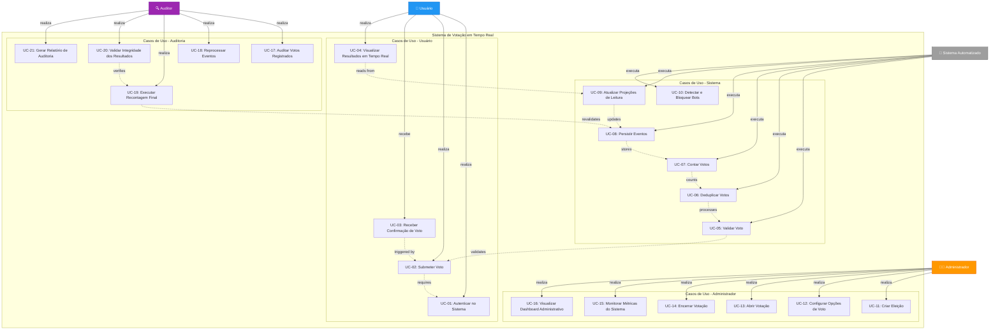

# Diagrama de Casos de Uso
## Sistema de Votação em Tempo Real



## Detalhamento dos Casos de Uso

---

### 👤 Casos de Uso - Usuário

#### UC-01: Autenticar no Sistema
**Descrição**: Usuário realiza login no sistema para poder exercer seu direito de voto.

**Pré-condições**:
- Usuário possui credenciais válidas
- Sistema está disponível

**Fluxo Principal**:
1. Usuário acessa a interface de login
2. Sistema exibe formulário de autenticação
3. Usuário fornece credenciais (email/senha ou OAuth)
4. Sistema valida credenciais
5. Sistema gera token de autenticação (JWT)
6. Usuário é redirecionado para interface de votação

**Pós-condições**:
- Usuário autenticado com sessão válida
- Token JWT armazenado no cliente

---

#### UC-02: Submeter Voto
**Descrição**: Usuário registra seu voto em uma eleição ativa.

**Pré-condições**:
- Usuário está autenticado
- Eleição está aberta
- Usuário ainda não votou nesta eleição

**Fluxo Principal**:
1. Usuário seleciona opção de voto
2. Sistema exibe confirmação da escolha
3. Usuário confirma o voto
4. Sistema valida requisição (anti-bot, rate limiting)
5. Vote Ingestion Service valida formato do voto
6. Evento de voto é publicado no Kafka
7. Sistema retorna confirmação ao usuário

**Fluxos Alternativos**:
- **FA-01**: Usuário já votou - Sistema rejeita e informa
- **FA-02**: Eleição encerrada - Sistema bloqueia voto
- **FA-03**: Falha de validação - Sistema retorna erro específico

**Pós-condições**:
- Voto registrado no sistema
- Evento publicado no Kafka
- Usuário recebe confirmação

---

#### UC-03: Receber Confirmação de Voto
**Descrição**: Usuário recebe feedback visual de que seu voto foi registrado com sucesso.

**Pré-condições**:
- Voto foi submetido com sucesso

**Fluxo Principal**:
1. Sistema processa voto
2. Sistema gera confirmação com ID único
3. Usuário visualiza mensagem de sucesso
4. Sistema exibe recibo de votação (opcional)

**Pós-condições**:
- Usuário tem certeza de que voto foi contabilizado

---

#### UC-04: Visualizar Resultados em Tempo Real
**Descrição**: Usuário acompanha a apuração dos votos conforme a eleição acontece.

**Pré-condições**:
- Eleição está ativa ou encerrada
- Resultados estão habilitados para visualização

**Fluxo Principal**:
1. Usuário acessa interface de resultados
2. Sistema estabelece conexão WebSocket/SSE
3. Result Service busca dados no Redis
4. Sistema envia atualizações em tempo real
5. Interface atualiza contadores e gráficos automaticamente

**Pós-condições**:
- Usuário visualiza resultados atualizados continuamente

---

### 🤖 Casos de Uso - Sistema Automatizado

#### UC-05: Validar Voto
**Descrição**: Sistema verifica se o voto atende todos os critérios de aceitação.

**Pré-condições**:
- Voto foi recebido pelo Vote Ingestion Service

**Validações Realizadas**:
- ✅ Token JWT válido
- ✅ Formato do payload correto
- ✅ Eleição existe e está ativa
- ✅ Opção de voto é válida
- ✅ Rate limiting não foi excedido
- ✅ Requisição não veio de bot (WAF)

**Pós-condições**:
- Voto marcado como válido ou rejeitado

---

#### UC-06: Deduplicar Votos
**Descrição**: Sistema garante que cada usuário vote apenas uma vez.

**Pré-condições**:
- Voto foi validado
- Evento publicado no Kafka

**Fluxo Principal**:
1. Kafka Streams consome evento do tópico
2. Sistema verifica State Store local (userId)
3. Se usuário não votou:
   - Adiciona userId ao State Store
   - Permite processamento do voto
4. Se usuário já votou:
   - Rejeita voto duplicado
   - Loga tentativa para auditoria

**Mecanismos**:
- State Store do Kafka Streams
- Particionamento por userId
- Exactly-once semantics

**Pós-condições**:
- Voto único garantido por usuário

---

#### UC-07: Contar Votos
**Descrição**: Sistema incrementa contadores de cada opção de voto.

**Pré-condições**:
- Voto foi deduplicado
- Voto é válido

**Fluxo Principal**:
1. Kafka Streams processa evento deduplic ado
2. Sistema incrementa contador da opção escolhida
3. Atualização é propagada para camada de persistência

**Pós-condições**:
- Contagem atualizada

---

#### UC-08: Persistir Eventos
**Descrição**: Sistema armazena todos os votos de forma imutável no DynamoDB.

**Pré-condições**:
- Voto foi contado

**Fluxo Principal**:
1. Sistema prepara registro do evento
2. DynamoDB recebe voto com timestamp
3. Registro é armazenado de forma imutável
4. Confirmação de persistência é gerada

**Estrutura do Evento**:
```json
{
  "voteId": "uuid",
  "userId": "user123",
  "electionId": "election456",
  "option": "candidate_A",
  "timestamp": "2026-01-16T10:30:00Z",
  "metadata": {...}
}
```

**Pós-condições**:
- Source of truth atualizada

---

#### UC-09: Atualizar Projeções de Leitura
**Descrição**: Sistema atualiza Redis com contagem parcial para leitura rápida.

**Pré-condições**:
- Voto foi persistido no DynamoDB

**Fluxo Principal**:
1. Sistema incrementa contadores no Redis
2. Atualização é realizada de forma atômica
3. Clientes conectados via WebSocket recebem notificação

**Estrutura no Redis**:
```
election:123:candidate_A -> 150234
election:123:candidate_B -> 98765
election:123:total -> 249999
```

**Pós-condições**:
- Read model atualizado
- Resultados disponíveis em tempo real

---

#### UC-10: Detectar e Bloquear Bots
**Descrição**: Sistema identifica e bloqueia tentativas automatizadas de voto.

**Mecanismos**:
- WAF com regras anti-bot
- CAPTCHA em requisições suspeitas
- Rate limiting por IP/usuário
- Análise comportamental

**Pós-condições**:
- Requisições maliciosas bloqueadas

---

### 👨‍💼 Casos de Uso - Administrador

#### UC-11: Criar Eleição
**Descrição**: Administrador configura uma nova eleição no sistema.

**Pré-condições**:
- Administrador está autenticado
- Possui permissões de criação

**Fluxo Principal**:
1. Admin acessa interface de gestão
2. Sistema exibe formulário de criação
3. Admin define:
   - Título da eleição
   - Descrição
   - Data/hora de início
   - Data/hora de término
   - Opções de voto
4. Sistema valida configurações
5. Eleição é criada com status "Rascunho"

**Pós-condições**:
- Nova eleição disponível para configuração

---

#### UC-12: Configurar Opções de Voto
**Descrição**: Administrador define as opções disponíveis para votação.

**Fluxo Principal**:
1. Admin seleciona eleição
2. Sistema exibe editor de opções
3. Admin adiciona/edita/remove opções
4. Sistema valida unicidade e formato
5. Configurações são salvas

**Pós-condições**:
- Opções de voto definidas

---

#### UC-13: Abrir Votação
**Descrição**: Administrador inicia o período de votação.

**Pré-condições**:
- Eleição está configurada
- Data de início chegou (ou override manual)

**Fluxo Principal**:
1. Admin clica em "Abrir Votação"
2. Sistema valida configurações
3. Status da eleição muda para "Ativa"
4. Tópicos Kafka são criados/preparados
5. Sistema libera interface de votação

**Pós-condições**:
- Eleição ativa e aceitando votos

---

#### UC-14: Encerrar Votação
**Descrição**: Administrador finaliza o período de votação e inicia apuração final.

**Pré-condições**:
- Eleição está ativa
- Data de término chegou (ou encerramento manual)

**Fluxo Principal**:
1. Admin clica em "Encerrar Votação"
2. Sistema bloqueia novos votos
3. Status muda para "Encerrada"
4. Scheduled job inicia recontagem final
5. Resultado oficial é publicado

**Pós-condições**:
- Eleição encerrada
- Resultado final disponível

---

#### UC-15: Monitorar Métricas do Sistema
**Descrição**: Administrador acompanha performance e saúde do sistema.

**Métricas Monitoradas**:
- Votos por segundo
- Latência de processamento
- Taxa de rejeição
- Utilização de recursos (Kafka, DynamoDB, Redis)
- Erros e alertas

**Pós-condições**:
- Visibilidade operacional do sistema

---

#### UC-16: Visualizar Dashboard Administrativo
**Descrição**: Administrador acessa painel consolidado com todas as informações relevantes.

**Informações Exibidas**:
- Eleições ativas
- Total de votos registrados
- Estatísticas em tempo real
- Alertas e notificações
- Logs de auditoria

---

### 🔍 Casos de Uso - Auditoria

#### UC-17: Auditar Votos Registrados
**Descrição**: Auditor verifica integridade e validade dos votos armazenados.

**Pré-condições**:
- Auditor possui credenciais e permissões
- Eleição está encerrada (ou auditoria intermediária)

**Fluxo Principal**:
1. Auditor acessa interface de auditoria
2. Sistema exibe filtros de busca
3. Auditor define critérios (período, eleição, usuário)
4. Sistema busca eventos no DynamoDB
5. Auditor analisa registros e metadados

**Pós-condições**:
- Votos auditados e validados

---

#### UC-18: Reprocessar Eventos
**Descrição**: Auditor reprocessa eventos em caso de inconsistências detectadas.

**Pré-condições**:
- Inconsistência foi identificada
- Aprovação para reprocessamento foi concedida

**Fluxo Principal**:
1. Auditor seleciona eventos para reprocessamento
2. Sistema cria job de reprocessamento
3. Eventos são consumidos novamente do DynamoDB
4. Kafka Streams reaplica lógica de contagem
5. Projeções são recalculadas
6. Relatório de reprocessamento é gerado

**Pós-condições**:
- Inconsistências corrigidas
- Histórico de reprocessamento registrado

---

#### UC-19: Executar Recontagem Final
**Descrição**: Sistema executa contagem oficial baseada no source of truth.

**Pré-condições**:
- Eleição foi encerrada

**Fluxo Principal**:
1. Scheduled job é disparado automaticamente
2. Sistema lê TODOS os eventos do DynamoDB
3. Contagem é realizada de forma sequencial
4. Resultado é comparado com Redis
5. Se divergências:
   - Logs são gerados
   - Alertas são disparados
6. Redis é atualizado com resultado oficial

**Pós-condições**:
- Resultado oficial e auditável disponível

---

#### UC-20: Validar Integridade dos Resultados
**Descrição**: Auditor verifica consistência entre DynamoDB e Redis.

**Validações**:
- Total de votos DynamoDB = Total de votos Redis
- Votos por opção DynamoDB = Votos por opção Redis
- Nenhum voto duplicado
- Todos os usuários votaram apenas uma vez

**Pós-condições**:
- Integridade validada ou inconsistências reportadas

---

#### UC-21: Gerar Relatório de Auditoria
**Descrição**: Sistema gera relatório completo para compliance e transparência.

**Conteúdo do Relatório**:
- Total de votos registrados
- Distribuição por opção
- Timeline de votação
- Votos rejeitados e motivos
- Tentativas de fraude bloqueadas
- Reprocessamentos realizados
- Assinaturas digitais (checksums)

**Formato**: PDF, JSON, CSV

**Pós-condições**:
- Relatório gerado e disponível para download

---

## Relações entre Casos de Uso

### Dependências Críticas

```
UC-02 (Submeter Voto)
  ↓
UC-05 (Validar Voto)
  ↓
UC-06 (Deduplicar Votos)
  ↓
UC-07 (Contar Votos)
  ↓
UC-08 (Persistir Eventos)
  ↓
UC-09 (Atualizar Projeções)
  ↓
UC-04 (Visualizar Resultados)
```

### Fluxo de Auditoria

```
UC-08 (Persistir Eventos)
  ↓
UC-17 (Auditar Votos)
  ↓
UC-19 (Recontagem Final)
  ↓
UC-20 (Validar Integridade)
  ↓
UC-21 (Gerar Relatório)
```

---

## Requisitos Não Funcionais Associados

| Caso de Uso | Requisitos Não Funcionais |
|-------------|---------------------------|
| UC-02, UC-05, UC-06 | Performance: < 200ms para validação e deduplicação |
| UC-07, UC-09 | Throughput: Suportar 250k votos/segundo em picos |
| UC-04 | Latência: Resultados atualizados em < 2 segundos |
| UC-08 | Confiabilidade: 99.99% de persistência garantida |
| UC-06 | Consistência: Exactly-once processing garantido |
| UC-19, UC-20 | Auditabilidade: 100% dos eventos rastreáveis |
| UC-10 | Segurança: Bloquear 99% dos ataques automatizados |
| UC-15 | Observabilidade: Métricas em tempo real com < 5s delay |

---

## Priorização dos Casos de Uso

### 🔴 Críticos (Lançamento MVP)
- UC-01, UC-02, UC-03, UC-04 (Fluxo de votação completo)
- UC-05, UC-06, UC-07, UC-08, UC-09 (Processamento core)
- UC-11, UC-13, UC-14 (Gestão básica de eleições)

### 🟡 Importantes (Fase 2)
- UC-12 (Configuração avançada)
- UC-15, UC-16 (Monitoramento)
- UC-17, UC-19, UC-20 (Auditoria básica)

### 🟢 Desejáveis (Fase 3)
- UC-10 (Anti-bot avançado)
- UC-18 (Reprocessamento)
- UC-21 (Relatórios completos)
